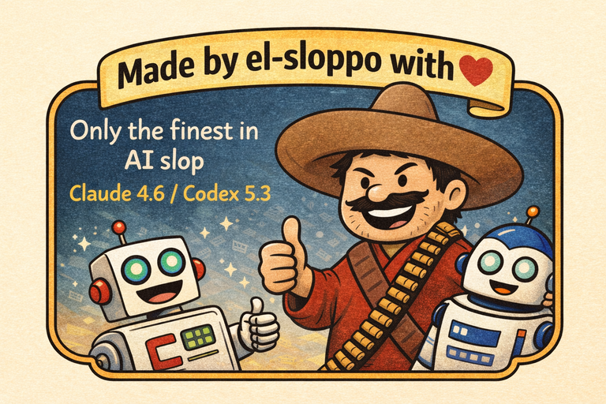

# AI Dev Disclosure (RETROSPECTIVE)

This project was built with significant assistance from AI tooling
using an "agent" driven method.
Claude Code 4.6 Opus (Anthropic) handles the multi-step code generation
process -- Emacs Lisp, C, and POSIX shell -- including tests,
documentation, and refactoring.  Codex 5.3 Extra High (OpenAI) is used
for the review process and plan generation.  Every change goes through
the same CI pipeline (`make check`) and is reviewed by the maintainer
before merge.  The commit history is transparent: AI-assisted commits
carry a `Co-Authored-By: Claude` trailer.

Significant human effort **still** drives the project direction, engineering
decisions, and quality control -- the models require constant course
correction (they will confidently produce incorrect code and claim it
works).  The project was created for fun, and as an experiment to see
how far current AI models can go on a non-trivial codebase.  After
500+ commits the takeaway is clear: every feature required substantial
human intervention in testing, troubleshooting, and iteration.  Current
models cannot one-shot code projects.  The technology has made
impressive strides, but the gap between "generate plausible code" and
"ship reliable software" remains wide.

To date the most effective method has been:

1. Have Codex 5.3 Extra High generate a detailed, multi-phase requirements and
   specification plan file (`PLAN.md`), leaving no wiggle room or
   ambiguity.
2. Human iterates the plan with Codex until satisfied.
3. Have Claude 4.6 Opus implement the plan.
4. Have Codex 5.3 Extra High review and audit the codebase against the
   plan, phase by phase.
5. Have Claude 4.6 Opus fix repeatedly until Codex is satisfied.
6. Maintain a detailed `CLAUDE.md` / `AGENTS.md` file (as demonstrated in this repo)
   that encodes project conventions, module structure, and coding
   standards so the model has persistent context.
7. Enforce a strong test policy -- syntax checking, compile-time
   validation, runtime smoke tests, and unit tests -- such that
   "anything that can be tested should be tested."

Using AI-driven development in this way is less painful, while far
from divine -- and arguably still suboptimal.  The human behind this
project did not sign up to be a babysitter for robots.

It should be admitted that many have tried to produce a static Emacs
build over the years -- most failing -- and nobody bothered to add
zombie reaping as a feature flag with `--pid1`.  None of the toy
projects from the last few decades actually did it.  The difference
now is that you can throw ambitious assignments at bots and let them
do the tedious work that no human really wants to do.  There is a
strong use case for AI as a tool in that regard.  But as for coding
itself?  Humans still want to do it, and they remain better at
decision making and judgement calls overall -- they have true
rationality, not a system programmed to emulate it.

The human behind this project wishes to remain anonymous (and does not
want credit), as this project will likely generate controversy.  It is
released under GPL-3.0 -- fitting, given that probably 99% of the
Emacs Lisp code these models were trained on was also GPL-3.0.
